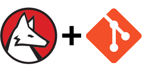

# GitLink for Wolfram Language

GitLink is a package for integrating [git](https://git-scm.com/) functionality into the [Wolfram Language](https://www.wolfram.com/language/). GitLink supports 11.1 and later versions of Wolfram Language deployments for the desktop, including [Wolfram Desktop](https://www.wolfram.com/desktop/) and [Mathematica](https://www.wolfram.com/mathematica/).

### Installing the GitLink release

The GitLink release comes in the form of a `.paclet` file, which contains the entire package and its documentation. Download the latest release from the [Github repo's releases page](https://github.com/WolframResearch/GitLink/releases). To install, run the following command in the Wolfram Language:

    PacletInstall["/full/path/to/GitLink.paclet"]

This will permanently install the GitLink paclet. The Wolfram Language will always use the latest installed version of GitLink. Installed versions can be enumerated using the command:

    PacletFind["GitLink"]

And all versions can be uninstalled using the command:

    PacletUninstall["GitLink"]

### Using GitLink

To access the documentation, open the notebook interface help viewer, and search for GitLink. The first hit will be a summary page enumerating the most commonly used functions in GitLink. It also includes links to other summary pages enumerating a full list of functions for branches and references, and for low-level git operations.

To start, load the GitLink package, and try opening a repository and enumerating the tip of its master branch.

    Needs["GitLink`"]
    r = GitOpen["/full/path/to/a/git/repo"]
    c = ToGitObject[r, "master"]
    GitProperties[c]

Congratulations! You're well on your way to reading and manipulating git repos with GitLink.

### Where did this come from?

GitLink is a paclet maintained by [John Fultz](https://github.com/jfultz) of Wolfram Research, with significant help from Lou D'Andria, Alex Newman, and other Wolfram Research staff.  John Fultz began building GitLink for his own use, and later worked with Lou and Alex to create and deploy tools that are used widely within Wolfram Research.

GitLink is implemented on top of the excellent [libgit2 project](https://libgit2.github.com/). However, rather than expose a simple set of libgit2 bindings, we've chosen to expose a high level interface to git which plays to the strengths of the Wolfram Language.

### ...and where's it going?

GitLink is ultimately slated to become a part of the official Wolfram Language release. Before that happens, more functionality will need to be implemented, and the product will be subjected to our rigorous design review process, which may introduce incompatibilities with the existing version. However, it is our intent to keep the source open even after we ship the final product, and to continue to be welcome to community contributions that can improve future versions of GitLink.

Major areas of GitLink which are not yet implemented include support for diff, blame, rebase, submodule, and config functionality. Additionally, we need to improve support for various git protocols for pushing and fetching.

### More...

See the following files for more information:

* [COPYING.md](COPYING.md) - GitLink license
* [CONTRIBUTING.md](CONTRIBUTING.md) - Guidelines for contributing to GitLink
* [HowToBuild.md](HowToBuild.md) - Instructions for building and debugging GitLink
